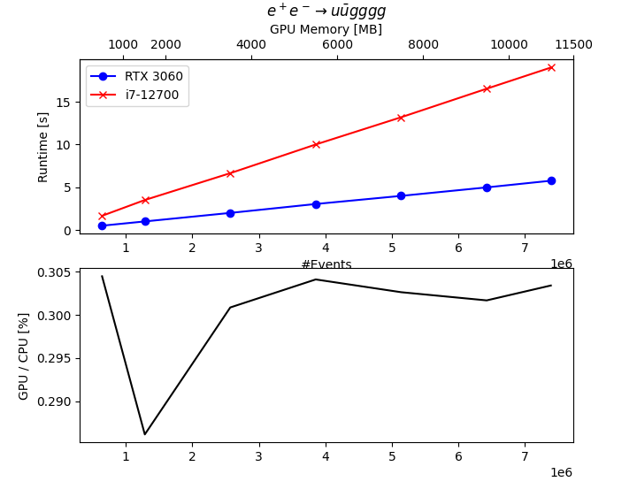

# gpu_phs
Recursive phase-space generation on GPUs using CUDA.

This project models the phase space generation step in the HEP event simulator Whizard. The original algorithm has a very imperative nature by recursively iterating through the branches of kinematic trees. The program in this repository is a data-centric portation which can be executed on GPUs.
The phase space generation is one crucial step in the Whizard program flow. Most, having a parallelized implementation allows for the efficient usage of parallelized QFT matrix element evaluations.

## Building the Project

We use rapidjson as a git submodule to read input files. Therefore, when cloning this repository, you must do it like this:
```
git clone --recursive https://github.com/MeisterEule/gpu_phs
```

If you have cloned this repository without this option, you can retroactively activate the submodule via
```
git submodule update --init
```

The program is build using `make`. You need an Nvida compiler (nvcc) to compile.

## Layout of the serial algorithm

The serial phase space generation in Whizard for an individual phase space tree consitsts of two steps. In the first one, each internal branch of the tree gets assigned an off-shell four-vector magnitude `msq` and decay momenta `p_decay`. The construction happens in each particle's rest frame, so that 1 -> 2 decay kinematics can be applied. 
The momenta are applied in a recursive way. The recursion starts at the root branch proceeds on child branches, if they have children themselves. This way, only internal branches are traversed. On each of them, `msq` is computed from a random number x with a mapping function. The form of the mapping function depends on the process and the branch and is determined by Whizard. 

The second step of four-momenta construction is the generation of scattering angles `theta` and `phi` and the boost from the rest frame into the lab frame. This is also a recursive algorithm, which has two parts. One part computes the scattering angles from random numbers, where `phi` is simply `2*pi*x`, whereas `theta` is generated as `cos(theta)` from a mapping function similarly to `msq`. This is done for internal branches only. The other part are boosts from the rest frame to the lab frame. The boost velocity is obtained from `p_decay`, computed in the first step, the direction from the scattering angles. It is crucial to note that the boost applied to a branch is the product of the boosts of all the parent branches. The boost matrix is an argument to the recursive function `set_angles`, and for each call a new array of dimension 16 is put on the stack. 

It must be noted that in step one, the random numbers given to the function can correspond to kinematically forbidden regions. In that case, the function returns `ok = false`, and the second step is skipped. The integration grids will be adapted in Whizard, so that the number of points for which this test will fail decreases.

## Porting approach

When porting to a GPU, these are the major points that need to be addressed

1. Generally, branches (if-statements) should be avoided as much as possible. A GPU core (SMT) cannot evaluate branches like a CPU does. Instead, for each branch, a separate run of the kernel is performed. Each time, all the threads take part, but only the ones for which the condition is true are actually computed on. This is a waste of resources, especially for deeply nested branch conditions. In the phase space generation, branches take place at two important places: The recursion and the selection of mapping functions. The first issue is discussed in the next point below. In the second case, the serial algorithm checks integer constants and conditionally executes the mapping function. Moreover, some of these mapping functions contain if-statements themselves, e.g. to check if certain contsants have been initialzed or if a random number lies in a certain range. To deal with this issue, the parallel algorithm implements the mapping functions through function pointers. For each thread + branch combination, the mapping type is determined in the initialization phase, and the function pointer is connected to a suitable `__device__` function. All constants are also computed beforehand. This way, all threads in a warp circumvent kernel-side branches, except for one mapping function, which checks the value of the random number x. This might be optimized by sorting the random numbers beforehand, but the number of warp divergences originating from this branch should be rather small. It should be measured properly before introducing the overhead of sorting `x`.

2. Apart from branches, recursion is also not well suited for GPUs due to the increasing number of compute registers required. It is very easy to run in the `too many resources requested for launch` error. This happens when the product of kernel registers and the number of threads exceeds to total number of registers. The nvcc compiler has the `-res-usage` option which gives information about the register requirements of a kernel.  For example, with sm_80, a kernel must not exceed 64 registers to allow for 1024 threads to run. The problem can be circumvented by decreasing the number of threads, which is usually not a desirable option. Test versions of a pure-GPU of the algorithm have shown to have large register requirements, so that the number of threads needed to be reduced significantly below 100. (I am not sure, how the number of registers is determined for a recursive function, but I guess that more space is allocated than is actually used to be on the safe side concerning unknown recursion depth). The parallel algorithm avoids recursion entirely. The branch indices which are processed in both the off-shell generation and the boost application are extracted beforehand, and the respective kernels loop over these indices to perform the corresponding calculations.

3. Like in many other applications, the data movement between CPU and GPU is the performance bottleneck. Therefore, the number of times a field is copied with `cudaMemcpy` should be kept as low as possible. Wherever possible, arrays are allocated only on the device. Moreover, the number of events per memcpy should be as large as possible. Here, the limiting factor are the arrays which contain the final momenta. Probably equally important is the goal to use as much GPU memory as possible, as efficiently as possible, since this increases the number of events which can be transferred for each kernel execution. In the Whizard implementation, the phase space generation takes place on arrays which have one element for each possible combination of tree momenta. This requires $2^n-1$ elements in total, but only $2n-1$ are actually worked on. The exponential growth is not much of concern in Whizard, where only one of these arrays exists at any time, but is a major slowdown for a GPU implementation where these arrays must exist for every thread, but most of the space stays unused. In principle, one could work with shared memory and combine threads with channels with disjoint branch indices. However, it is much simpler to just use the reduced representation with $2n-1$ array elements, since each thread does not need more than this.


## Performance Considerations

The plot below shows a runtime comparison between the serial implementation running on an Intel i7-12700 CPU and the GPU implementation running on an entry-level Nvidia RTX 3060, hosted on the same system. The number of events is increased until the GPU memory is filled up. We observe a consistent improvement of 70% in the total runtime.



The program contains timers which measure the six GPU-relevant contributions: Memcpy In/Out and kernels for Init, MSQ, the creation of boost and the application of boosts. 


The dominating contribution is not surprisingly the transfer of kinematical variables from the device to the host, making up about half of the total GPU time. This number must be considered with caution because of two aspects: First, it also contains the translation of momenta from the GPU format to the Whizard format, which happens serially on the CPU. This contributes to 50% to the total Memcpy time, making up 25% of the entire GPU time. The second, more important, aspect, making it doubtful if an optimization of the first issue is worthwhile, is the fact that in an event generator, the generated momenta would be kept on the device for the entire computation. Therefore, the Memcpy contribution is a remnant of this setup.
The second largest chunk of runtime is taken up by the creation of boosts. There a sequential multiplications of 4 x 4 matrices for each thread, something which can probably be optimized by employing higher levels of parallelism.


